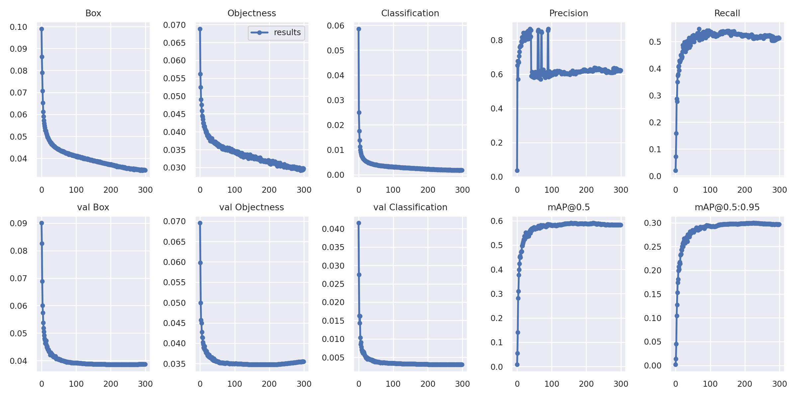

#  <div align="center">Tutorial to train YOLOv5 for FLIRdataset</div>

## Download FLIR dataset using the link below
https://www.kaggle.com/deepnewbie/flir-thermal-images-dataset

## Convert FLIR dataset to yolov5 format
Copy my createFLIR.py to your current dataset folder and run it to convert FLIR dataset to yolov5 format
```
python3 createFLIR.py
```

## Installation
```
git clone https://github.com/ultralytics/yolov5
cd yolov5
pip install -r requirements.txt
```

## Copy data.yaml and custom_yolov5s.yaml 
Edit my data.yaml where you need to change /home/user/ to whatever path you have on your local machine and put it in ./yolov5 

Copy my custom_yolov5s.yaml and put it in ./yolov5/models

## Train
Run the code below to start training YOLOv5 on FLIR dataset for 300 epochs using cuda device. If you don't have cuda installed, remove --device 0 option.

Change /home/user/ to whatever path you have on your local machine
```
python3 train.py --img 640 --batch 16 --epochs 300 --data '/home/user/yolov5/data.yaml' --cfg /home/user/FLIRyolov5/yolov5/models/custom_yolov5s.yaml --weights '/home/user/yolov5/runs/train/yolov5s_results2/weights/best.pt' --name yolov5s_results  --cache --device 0 
```
## Performance
Achieve mAP = 58%

<p>

</p>

## Inference
Change /home/user/ to whatever path you have on your local machine

Change "yolov5s_results" in --weights '/home/user/yolov5/runs/train/<i>yolov5s_results</i>/weights/best.pt' to your needed pretrained weight e.g. yolov5s_results, yolov5s_results1, yolov5s_results2, etc. Each time you train your model, there will be one additional yolov5s_results* folder. Pick the one you need.

```
python3 detect.py --weights '/home/user/yolov5/runs/train/yolov5s_results/weights/best.pt' --img 416 --conf 0.4 --source '/home/user/yolov5/video/images' --device 0
```

## Inference result examples
I got 50.07 FPS for inference time using Quadro RTX 6000 96 GB multi GPUs. Below are some inference examples from the FLIR dataset:
<p>


</p>

## Contact
Feel free to contact me if you have any issue. 

## Reference
Link to the original YOLOv5 github https://github.com/ultralytics/yolov5

